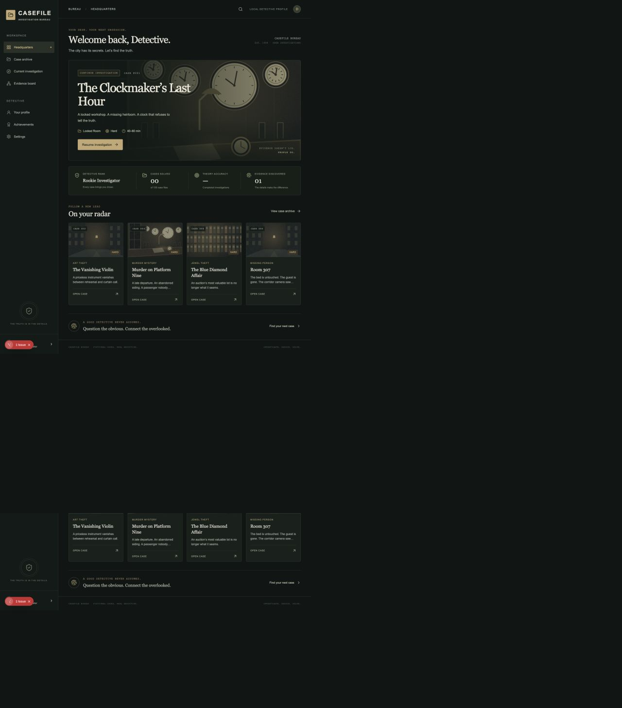
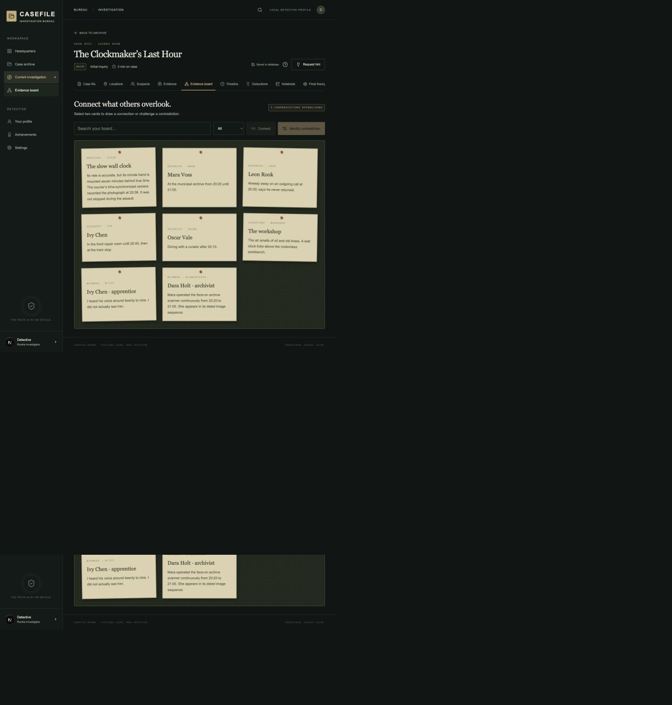

# CASEFILE

**Investigate. Deduce. Solve.**

A responsive, noir-inspired mystery investigation game. Enter scenes, secure and analyze exhibits, question suspects, compare statements, establish deductions, reconstruct the chronology, and submit a complete evidence-backed theory.

## Content status

**100 visible archive entries. 11 playable investigations. 89 explicitly labeled story outlines.** The archive never offers an unfinished case as playable.

| Case    | Title                       | Authored content                                                                                                             |
| ------- | --------------------------- | ---------------------------------------------------------------------------------------------------------------------------- |
| 001     | The Clockmaker’s Last Hour  | 4 suspects, 5 locations, 16 exhibits, 3 witnesses, 14 interview questions, 6 deductions, 3 contradictions, 6 final questions |
| 002     | The Vanishing Violin        | Art theft; instrument custody and physical substitution                                                                      |
| 003     | Murder on Platform Nine     | Murder; ticket identity versus physical presence                                                                             |
| 004     | The Blue Diamond Affair     | Jewel theft; manipulated comparison test                                                                                     |
| 005     | Room 307                    | Missing person; inconsistent room records                                                                                    |
| 006     | The Last Email              | Cybercrime; submission, credentials, and delivery                                                                            |
| 007     | The Riverside Disappearance | Missing person; physical staging and river evidence                                                                          |
| 008     | The Museum Without Shadows  | Museum heist; a compromised observation                                                                                      |
| 009     | The Broken Alibi            | Insurance fraud; preparation versus ignition                                                                                 |
| 010     | The Black Envelope          | Blackmail; revision history and printing custody                                                                             |
| 011     | The Silent Witness          | Sabotage; sensor limitations and mechanical evidence                                                                         |
| 012–100 | See `data/catalog.ts`       | Distinct premises, settings, and reasoning outlines; not playable                                                            |

Cases 002–011 each have 3 suspects, 3 locations including a gated follow-up search, 8 exhibits, 6 interview questions, 3 deductions, a contradiction, timeline reconstruction, and a final theory. They share a content compiler and interaction grammar, with independently authored mechanisms and clues. They are shorter than Case 001.

The intended archive progression is Hard (001–015), Very Hard (016–040), Expert (041–070), Master Detective (071–090), and Legendary (091–100). Only the initial Hard cases are authored today. Estimated durations are editorial estimates, not measured playtest results.

## Screenshots





The UI uses local, original SVG placeholder artwork in `public/cases/`; no remote images or third-party asset requests are required. Headquarters has an illustrated clockmaker hero, the archive has case-file cards, and investigations have interactive scenes and a parchment evidence board. Replace the SVG paths in case records with finished case artwork without changing the engine.

## Features

- Five initial cases; each solved case unlocks two more authored cases.
- Scene hotspots with keyboard-accessible equivalents and evidence-gated locations.
- Initial observations separated from examiner analysis; analysis unlocks questions and deductions.
- Suspect interviews, witness accounts, explainable red herrings, and statement cards.
- Searchable evidence board with selectable cards, persisted connections, and validated contradictions. Connections render in a linked list beneath the board.
- Ordered chronology with keyboard-accessible up/down controls.
- Editable/deletable notes, pinned evidence, suspicious-suspect marks, and escalating hints.
- Complete theory evaluation with supporting evidence, a 1,000-point score, and detailed successful-case reconstruction.
- Incorrect theories retain the investigation without revealing individually correct answers.
- Database autosaves, optimistic version checks, and a localStorage retry buffer for one failed network action.
- Profile, XP, ten ranks, eight achievements, case history, and aggregate statistics.
- Mute/volume settings, synthesized effect cue, reading-size controls, reduced motion, optional field guide, and confirmed resets.
- Responsive layouts, native modal focus handling, visible focus indicators, semantic controls, and loading/error/empty states.

## Stack

Next.js 15 App Router, React 19, TypeScript, Tailwind CSS 4 with custom design tokens, Lucide, Prisma 6, SQLite, and Zod 4. Node.js 22 LTS or newer is recommended. The lockfile pins the tested dependency tree. Patched transitive dependency overrides are documented in `package.json`.

## Installation and environment

```bash
npm install
npx prisma generate
npx prisma migrate dev
npm run db:seed
npm run dev
```

Open **http://localhost:3000**. If another application owns that port, Next chooses another port and prints it. You can explicitly use `npm run dev -- --port 3002`.

`npm install` runs a small idempotent preparation script: it copies `.env.example` to `.env` only if absent, ensures an empty local database file exists, and generates Prisma Client. It never overwrites an existing environment or database.

The default environment is:

```dotenv
DATABASE_URL="file:./dev.db"
```

Prisma resolves this relative to `prisma/schema.prisma`. The database is `prisma/dev.db` and is ignored by Git. No external services, API keys, paid models, or network connections are needed during gameplay.

For an existing checkout, `npm run db:setup` applies checked-in migrations and reruns the idempotent seed. The seed writes 100 case metadata records, ten ranks, eight achievement definitions, and an optional zero-XP Detective record. Authored content remains in version-controlled TypeScript.

## Local profiles

Opening the application creates a browser-specific **Detective** profile with zero XP. An opaque, random, HttpOnly, SameSite cookie selects it; only a SHA-256 token hash is stored in the database. Names are display labels, not authentication credentials. Different browsers receive independent profiles. Clearing the cookie loses access to that profile; there is no account recovery or cross-device login yet.

`lib/session.ts` is the integration point for future Google/GitHub/email authentication. A production identity provider should associate its stable subject with `User`, keeping progress relations intact. Do not treat the current local profile as verified identity.

## Architecture and important files

```text
app/
  page.tsx                 Headquarters and resume entry
  archive/                 Searchable 100-case archive
  case/[id]/               Investigation route
  profile/ achievements/ settings/
  api/profile/             Local profile and statistics
  api/game/[id]/           Case loading and validated actions
  api/settings/            Preferences and confirmed resets
components/
  Provider.tsx             Profile/preferences context and sound support
  Shell.tsx                Responsive navigation
  CaseCard.tsx             Shared archive presentation
  game/Investigation.tsx   Request coordination and investigation tabs
  game/ScenePanels.tsx     Locations, exhibits, interviews
  game/ReasoningPanels.tsx Board, deductions, chronology, notes
  game/TheoryPanel.tsx     Complete theory and performance report
  ui/Modal.tsx             Native accessible dialog
lib/
  engine.ts                Pure action reducer and player-data projection
  session.ts               Browser session adapter and origin checks
  profile.ts               Profile aggregation
  db.ts                    Reused Prisma client
  constants.ts             Ranks and achievements
 data/
  catalog.ts               Public metadata and 89 outlines
  server-cases.ts          Server-only registry boundary
  cases/clockmaker.ts      Authored Case 001
  cases/solutions.ts       Private Case 001 solution
  cases/episodes.ts        Ten independently authored case scenarios/compiler
 types/game.ts             Case, evidence, progress, and result interfaces
 prisma/schema.prisma      Database models and constraints
 prisma/migrations/        Checked-in initial migration
 prisma/seed.ts            Idempotent metadata seed
 public/cases/             Locally stored placeholder illustrations
 tests/                    Engine, content, security-boundary, and API tests
 scripts/prepare-local.mjs Safe first-install setup
```

### Case engine and data boundary

The client sends **actions**, not score or progress snapshots. The API validates the request with Zod, checks the cookie, unlock requirements, and current version, then runs the reducer against the private solution. A transaction persists the new state and normalized discoveries. Version conflicts return HTTP 409 and reload the current save rather than overwriting it.

The player-data projection withholds unexamined analysis and unasked answers. The browser never receives `SecretSolution`, answer maps, hidden contradiction pairs, or private reconstruction prose before solving. Final theory choices are naturally visible, but no correct-answer flags are sent. Successful submission unseals the complete solution. Private source files must never be imported into client components; use the server-only registry.

### Database structure

`User` owns `PlayerProfile`, `Settings`, `CaseProgress`, and `PlayerAchievement`. `CaseProgress` references `Case` and owns `EvidenceDiscovery`, `LocationProgress`, `InterrogationProgress`, `DeductionProgress`, `PlayerNote`, and one `CaseResult`. `Achievement` and `DetectiveRank` are definitions. Foreign keys, cascading progress-child cleanup, compound uniqueness, and profile/time indexes prevent duplicate saves and awards.

The versioned `CaseProgress.state` is the authoritative aggregate, serialized as text for database portability. Normalized rows are derived in the same transaction. XP and successful results are awarded once. Resetting a case removes its score contribution; reset operations currently clear achievement awards, which can be earned again.

### Scoring

Correct final answers: 600 proportional points; exhibits found: 150; established contradictions: 100; correct chronology: 100; starting bonus: 50. Hints cost 25, rejected theories cost 75, and unsupported deductions/contradictions/chronology submissions cost 15. Scores are clamped to 0–1,000. A case closes only when every final answer is correct and the decisive evidence is attached. Two deductions and a corroborated timeline are prerequisites.

Time records visible play in 30-second increments and does not affect scoring; the last partial interval may be lost. The local retry buffer does not promise full offline gameplay, does not overwrite database state, and requires retry after reconnection. A lost response can produce a conflict; the latest database save takes precedence.

## Creating cases

1. Add public metadata to `data/catalog.ts` with a stable three-digit ID. Keep unpublished content marked `outline`.
2. Author a `MysteryCase` with unique IDs, locations and hotspots, independent evidence, gated interviews, witnesses, deductions, and theory choices.
3. Author the matching private `SecretSolution`: answers, deduction keys, valid contradiction pairs, chronology, required proof, three escalating hints, and reconstruction sections.
4. Register both in `data/server-cases.ts`. Never import the private registry into a client component.
5. Change the catalog status to `playable` only once its content graph is reachable and every conclusion is supported by a discoverable source.
6. Add the case to the solvability tests, run them, manually play it without using the answer key, and rerun the seed.

Case 001 is the expanded authoring example. `buildEpisode` is a compact content compiler for the additional cases, not a client-side puzzle generator. It preserves different evidence and crime mechanisms while reusing interface structure. No graphical admin case builder is included.

## Tests and build

```bash
npm test
npm run typecheck
npm run build
npm start
```

The unit/content suite checks all eleven cases can reach a perfect solution, gates cannot be bypassed, unseen analysis is withheld, save roundtrips work, and private solution prose is absent from built browser chunks. Run it **after a build** to check current client bundles.

With the local server running:

```bash
npm run test:integration
# For another port:
TEST_BASE_URL=http://localhost:3002 npm run test:integration
```

The integration script uses a new isolated cookie jar. It tests the entire Clockmaker solution, a wrong theory, score penalties, save/resume, version conflicts, achievements, rank advancement, case unlocks, preferences, and destructive-reset confirmation. It resets only its own test profile’s progress. Automated reachability does not establish editorial difficulty or substitute for human mystery playtesting.

## Deployment

The application uses standard Node.js Next.js routes and can run on a persistent Node host with SQLite. Back up the SQLite file consistently before upgrades. For hosted use, set `NODE_ENV=production`, use HTTPS, and run migrations before serving requests.

**Vercel requires a durable external database. Do not deploy the local SQLite file as a writable Vercel database.** To deploy there:

1. Provision hosted PostgreSQL and set a server-only `DATABASE_URL` in Vercel.
2. Change the Prisma datasource provider from `sqlite` to `postgresql` in a deployment branch.
3. Generate a **new PostgreSQL migration history** against a development PostgreSQL database; the checked-in SQLite migration cannot be applied to PostgreSQL.
4. Run `prisma migrate deploy` and `npm run db:seed` once from an appropriate deployment environment.
5. Build with `npm run build`; Vercel uses the standard Next.js preset.

The model uses portable scalar fields and avoids SQLite-specific application queries, but this PostgreSQL deployment path has not been exercised here. Authentication hardening, abuse controls, operational monitoring, and backups are required before operating a public service. This project has not been published or deployed.

## Limitations and next improvements

- 89 case outlines await full evidence, suspect, and solution authoring; later difficulty tiers are not playable yet.
- Cases 002–011 are compact authored investigations; expand their dialogue branches and multi-step proof chains through human playtesting.
- Local SVG artwork and shared placeholder portraits are intentional development assets. Replace them with case-specific photography/illustration.
- The board uses selectable cards and persistent linked pairs, not freely draggable cards with movable strings.
- A synthesized event sound is provided. Music volume is stored, but no ambient soundtrack is bundled.
- No external login, cross-device recovery, admin editor, or full offline mode.
- Resetting any case clears achievement awards; a future implementation should recalculate awards from retained results.
- Add a versioned content migration strategy before modifying IDs referenced by existing player saves.
- Add hosted-database deployment validation, rate limiting, broader assistive-technology testing, and independent editorial playtests before calling this production-ready.
